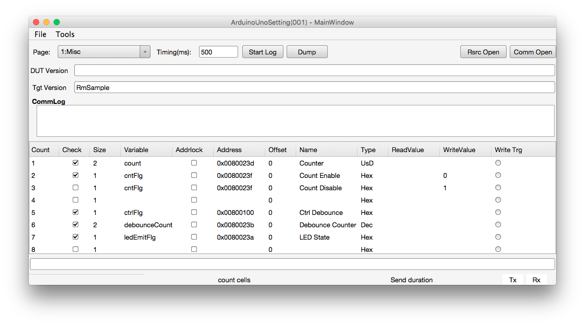

# RM-Classic-Cross-Platform
RM Classic Cross-Platform is developed with Mono/Gtk#.
You can download [Xamarin Studio(Windows/Mac OS X) or MonoDevelop(linux)](http://www.monodevelop.com/download/) and install the latest version.

Download zip file from this repository, you can find out the solution file(*.sln) in unzip folder, open solution file and build it.

It's the same way of using as Windows version [RM-Classic](https://github.com/NaoNaoMe/RM-Classic).

## License
MIT
